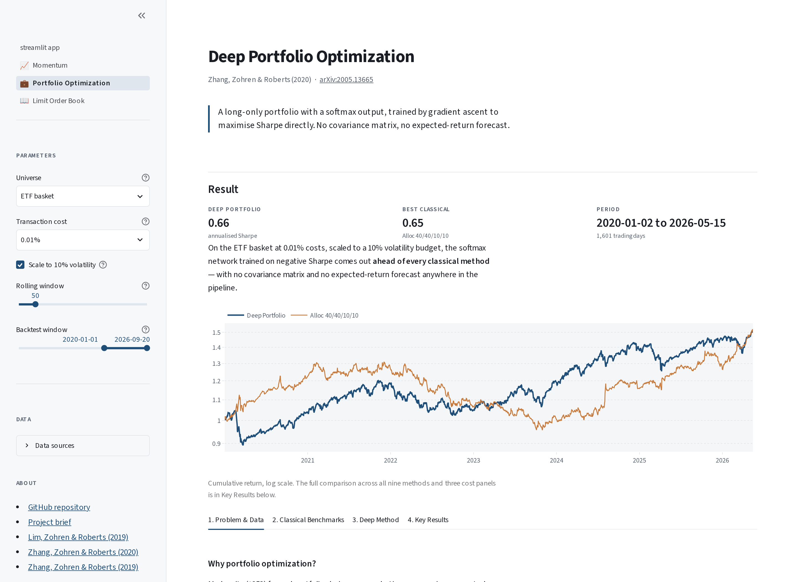

# Deep Finance Showcase

An interactive replication of three Oxford-Man Institute papers that apply deep
learning to canonical quantitative-finance problems: time-series momentum, portfolio
optimization, and limit order books.

Each page states the problem, reproduces the classical benchmark, implements the
paper's network, and compares them on the paper's own terms. Models are pre-trained
and bundled, so every page renders on a fresh clone with no API key and no GPU.

[](https://huggingface.co/spaces/JJ-JIN12345/dl-research-demo)
[](https://github.com/jjj1231978/dl-research-demo)
[](LICENSE)

[](https://huggingface.co/spaces/JJ-JIN12345/dl-research-demo)

## The papers

| Page | Paper | Venue | Model |
|---|---|---|---|
| Momentum | [Enhancing Time Series Momentum Strategies Using Deep Neural Networks](https://arxiv.org/abs/1904.04912) <br> Lim, Zohren & Roberts (2019) | Journal of Financial Data Science | LSTM and MLP with a Softsign head, trained on negative Sharpe |
| Portfolio Optimization | [Deep Learning for Portfolio Optimization](https://arxiv.org/abs/2005.13665) <br> Zhang, Zohren & Roberts (2020) | Journal of Financial Data Science | Long-only Softmax weights, trained on negative Sharpe |
| Limit Order Book | [DeepLOB: Deep Convolutional Neural Networks for Limit Order Books](https://arxiv.org/abs/1808.03668) <br> Zhang, Zohren & Roberts (2019) | IEEE Transactions on Signal Processing | CNN plus Inception plus LSTM, 3-way Softmax |

## The common thread

All three papers make the same move: bypass the prediction step and optimise the
financial objective end to end.

The classical pattern is two-step. Forecast a quantity (next-period return, mid-price
direction, an expected-return vector), then convert that forecast into a decision
(position size, signal sign, portfolio weights). Each step carries its own loss, and
the second step's gradients never reach the first.

The deep-learning move collapses the two steps into one network whose output *is* the
decision: a continuous position in `(-1, +1)` via Softsign, a long-only weight vector
summing to one via Softmax, or a class probability over mid-price movement via a
3-way Softmax. Training optimises the financial objective directly. No explicit
forecast is ever produced, because there is nothing to forecast and then size.

## Data

Every universe the app renders ships as a parquet in `data/`, so a fresh clone works
offline. The source column is where a refresh comes from when you run the fetch
scripts.

| Universe | Refresh source | Bundled in git |
|---|---|---|
| ETF basket (VTI, AGG, DBC, VIXY) | FMP API, `scripts/fetch_data.py` | `data/etf_basket.parquet` |
| 20-stock sector-balanced S&P 500 subset | FMP API, `scripts/fetch_data.py` | `data/sp500_20.parquet`, CSV fallback `data/portfolio_data.csv` |
| CME continuous futures, 18 BCOM roots, ratio-adjusted | databento lake, `scripts/fetch_futures.py` | `data/cme_futures.parquet` |
| FI-2010 limit order book | Kaggle `praanj/limit-orderbook-data`, `scripts/fetch_lob_fi2010.py` | `data/lob_fi2010_demo.parquet` (the full parquet stays local) |

An FMP API key is optional. Without one the app serves the bundled snapshots and says
so in the sidebar. Where the data substitutes for the paper's exact universe, the page
says which substitution was made and what it means for comparability.

## Run it locally

```bash
python3.11 -m venv .venv
source .venv/bin/activate
pip install -r requirements.txt
streamlit run streamlit_app.py
```

Opens at <http://localhost:7860>.

Optional, for live data:

```bash
cp .env.example .env
# add FMP_API_KEY=... to .env
```

## Tests

```bash
pytest -q                      # unit and integration
pytest tests/unit -q           # fast path
pytest --cov=src --cov-report=term-missing
```

Unit tests cover the classical strategies, metrics, model heads and checkpoint
loading. Integration tests render each page and assert on its structure.

## Retraining

Training is not needed to run the app. Checkpoints under `data/pretrained/` are
committed. To retrain:

```bash
pip install -r requirements-train.txt   # GPU torch
python -m src.training.train_deep_momentum --help
python -m src.training.train_deep_portfolio --help
python -m src.training.train_deeplob --help
```

Training runs on Modal serverless GPU containers; the Streamlit app itself never
invokes a GPU.

## Deployment

The Space builds from the `Dockerfile` (`sdk: docker`, `app_port: 7860`). Pushing to
`main` on the Hugging Face remote triggers a rebuild. `requirements.txt` is the
runtime dependency set and is pinned; `requirements-train.txt` is GPU-only and is not
installed in the Space image.

Deploy with:

```bash
scripts/deploy_hf.sh "Deploy: what changed"
```

The Space's history is deliberately squashed and separate from this repo's. Hugging
Face rejects raw binaries anywhere in a pushed commit range, and one commit here
added `docs/hero.png` before `*.png` was tracked in LFS, so replaying full history is
refused. The script pushes a single commit carrying `main`'s tree instead.

Pin dependencies against **Python 3.11**, not whatever interpreter is to hand — the
image is `python:3.11-slim`, and a pin resolved on 3.12 will fail the build (numpy
2.5 dropped 3.11). `requirements.txt` carries the check command.

## How this was built

This repo was developed spec-first. The design documents are kept in the repo because
they record the reasoning, not because the app depends on them:

- [`Project_brief.md`](Project_brief.md): the multi-phase roadmap and source-of-truth design doc
- [`specs/`](specs/): per-phase specification, plan, contracts and task breakdown
- [`.specify/memory/constitution.md`](.specify/memory/constitution.md): the project's non-negotiable principles

## Citation

If you use this replication, cite the original papers:

```bibtex
@article{lim2019enhancing,
  title   = {Enhancing Time Series Momentum Strategies Using Deep Neural Networks},
  author  = {Lim, Bryan and Zohren, Stefan and Roberts, Stephen},
  journal = {The Journal of Financial Data Science},
  year    = {2019},
  eprint  = {1904.04912}
}

@article{zhang2020deep,
  title  = {Deep Learning for Portfolio Optimization},
  author = {Zhang, Zihao and Zohren, Stefan and Roberts, Stephen},
  year   = {2020},
  eprint = {2005.13665}
}

@article{zhang2019deeplob,
  title   = {DeepLOB: Deep Convolutional Neural Networks for Limit Order Books},
  author  = {Zhang, Zihao and Zohren, Stefan and Roberts, Stephen},
  journal = {IEEE Transactions on Signal Processing},
  year    = {2019},
  eprint  = {1808.03668}
}
```

## License

MIT. See [`LICENSE`](LICENSE).

Paper authorship and results belong to the original authors. This repo is an
independent replication and is not affiliated with the Oxford-Man Institute.
